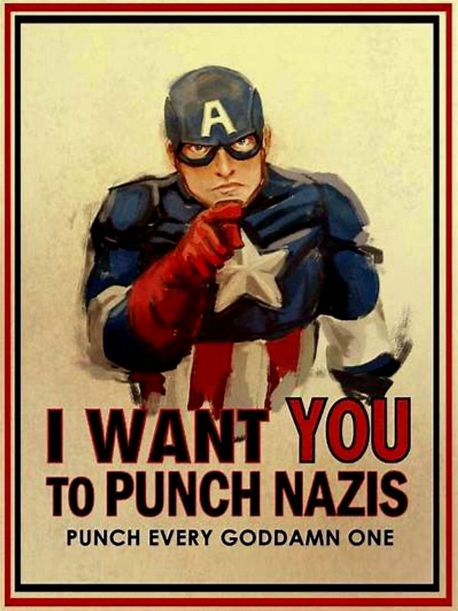

Sometime after 2016, politics became a contentious point in my marriage. She had come to an entirely different conclusion than me on which people represented what was good and honorable in America. This straight up vexxed me. And I don't use Shakesperean terms like "vexxed" lightly in 2024 without irony. 

I could not, for the life of me, understand how someone who claimed to have the same values as I do could vote for _that_ person. Unless they were lying to me. They were lying and those weren't their values at all. I began to see her (and other people like her) in my life as "bad". These were actually bad people masquerading as good ones. But their politics had revealed their true evil intent and I was fooled no longer. 

This filled me with anger. But it filled me with a different feeling as well. Righteous indignation. I felt...good. I mean "good" in the sense that I was 100% morally correct. I had found the high ground and from that position I could see the error of all those around me. I had never been so sure of myself in my life on virtually any complex cultural issue that you could bring up.  

It was at this point that I realized that it wasn't my wife that was a problem. It was me. There was something was very, very wrong with me.

The NYT ran an interesting article this past week in which a therapist writes about a couple who's marriage was precariously on the rocks over politics. Their disagreement on some core issues caused them to question each other's values and slowly they began to see each other as a bad peope. EXACTLY the same thing that had happened to me. It was comforting to know that I wasn't the only one, but I also already knew this was probably hapenning in other relationships as well. 

Apparently this is very common phenomenon in relationships, and it is known in the world of psychiatry as something called "splitting". 

### Splitting

Splitting is the human instinct to categorize people into two groups: All good, and all bad. Essentially, we cannot cope with the fact that people hold different positions or worldviews than we do and so we take all of our negative emotions about these issues and dump them into the other person, which then frees us up to be completely good while the other person is completely bad. It is especially common in close relationships like marriage because we cannot hide from the differing position. You live with this person and talk to them every day. And they are caught in the same news cycle you are, but they are coming to completely different conclusions. 

Splitting causes fear of the "other side", and extreme paranoia. It is quite literally a paranoid-schizoid position.

I realized this some years ago before this NYT article. But once I figured out what was happening - that I was viewing things as all good or all evil - I began to see it everywhere. And I could tell that most people have no idea that they are doing this. Nowhere is the phenomenon of splitting more on display that social media.

### Twitter, Bluesky and other echo chambers

In 2017, Twitter was a very left of center place. I rarely saw any convervative takes on any issues. Conservatives were almost always referred to as fascists or Nazi's. There was a popular image that circulated after the 2016 election that sums this up fairly well...

Notice what's happening in this image. We have Captain America, rich patriotic symbolism. And then we have a statement calling for violence against people in a certain group - Nazis. There is a critical question that goes unanswered though - and I assume this is be design. 

Who is a Nazi?

Do we mean Nazi's in the Germany circa World War 2 with the standard uniforms and arm bands? That seems like a weird thing to have a poster for considering I've never actually seen one in my entire life - at least not here in America.

Or is a Nazi anyone who suppports _that_ person. The one that you are pretty sure is a facist? If they have voted for that candidate, then they directly voted for fascism, and are at the very least guilty of complacency in Nazism if not outright Nazi's themselves.

This is splitting at it's finest. And you can see what it allows - a call for direct violence against people you disagree with. 

Now my guess here is that if you were to call the person who posted this on the above grey area, they would retreat to a position where what they _meant_ was that actual Nazi's who are actively engaged in lobbying for ethnic cleansing should be punched. 

Again, we don't need a poster if this is the case. I'm thinking something like 99.9% of people would support this punching. And I don't think that the people who post this would actually punch someone who voted for the "other guy", but I do think that in their mind they have lumped all of those people in with each other as being bad. Very bad. In fact, Nazi's.

Today, Twitter is a very right of center place, and I rarely see any progressive takes on any issues. Liberals are almost always reffered to as groomers and pedophiles. There is one account that needs no mention that is incredibly popular and particulary guilty of this. They will frequently repost videos from TikTok where teachers have posted videos about their intent to teach children certain controversial ideas.

There is no parent alive that doesn't want to ensure that their child is protected and not taught dangerous ideas at school. There is certainly a difference of opinion on what constitues a "dangerous" idea, but the point of this Twitter account is to make people with certain views feel as if the entire education system and everyone who supports it is out to groom their children. That pedophiles are in every classroom.

And what do we do with pedophiles and groomers when we feel they are a threat to our children? If it was my child, a punch would mean you got off lightly.

Again, the whole point here is to lump all liberals into a group that is clearly bad - unquestionably evil. And in fact the word "liberal" is in the very title of the account. They aren't even trying to hide the splitting.

Unfortunately, the splitting of X and Bluesky is likely to make this psycohological splitting much, much worse.

### Splitting and Echo Chambers

