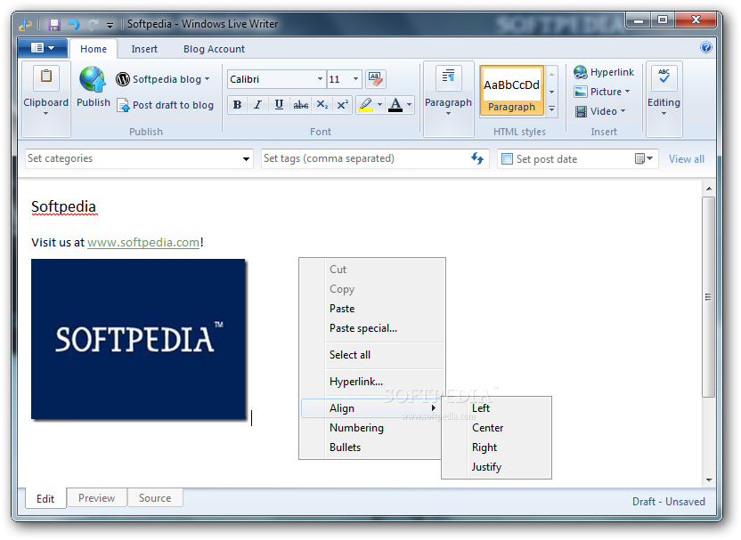
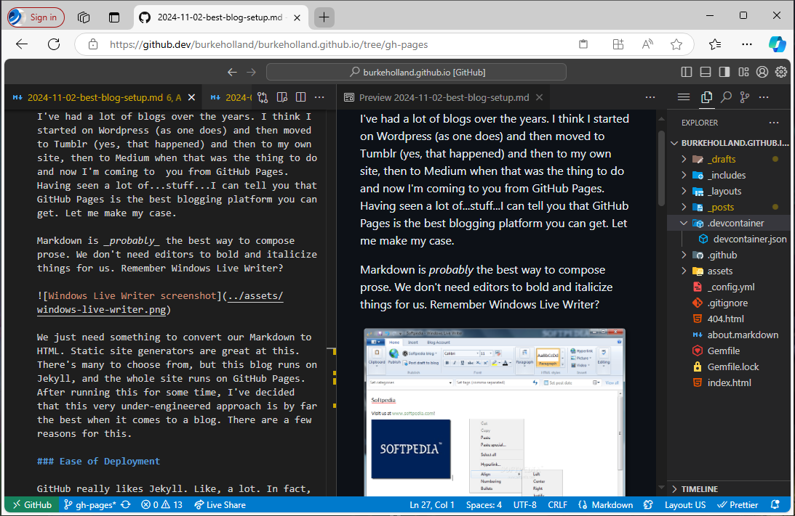

I've had a lot of blogs over the years. I think I started on Wordpress (as one does) and then moved to Tumblr (yes, that happened) and then to my own site, then to Medium when that was the thing to do and now I'm coming to you from GitHub Pages. Having seen a lot of...stuff...I can tell you that GitHub Pages/Jekyll is all you need. Let me make my case.

Markdown is _probably_ the best way to compose prose. We don't need editors to bold and italicize things for us. Remember Windows Live Writer?

We just need something to convert our Markdown to HTML. Static site generators are great at this. There's many to choose from, but when picking one for a blog, I chose Jekyll. Not because I'm super into Ruby or because I think it's somehow the best static site generator. It's simply because GitHub makes it so easy to delpoy a Jekyll site on GitHub Pages.

### Ease of Deployment

GitHub really likes Jekyll. Like, a lot. In fact, they make it so easy to deploy a Jekyll site to GitHub Pages that it's almost a no-brainer. There's no Action to configure. There's no build step to worry about. Just check your code in and it gets built with GitHub Actions. There's always that question of which branch to build from and where the source code sites, but I just put the source in gh-pages and a README in main that says "Source is in gh-pages". So I don't forget. Because I will.

The only downside to setting up Jekyll is having to fool with Ruby, but I get around all of that by using a [dev container](https://code.visualstudio.com/docs/devcontainers/create-dev-container)  in VS Code. There is one just for Jekyll that is preconfigured for you. Just choose "Add dev container congiguration files" in VS Code from the Command Palette and choose "Jekyll". Done.

### Ease Of Composition

Of course, you don't want to have to build and deploy your site everytime you want to write a blog post. But you don't have to. GitHub offers an in browser editing experience on any repo by pressing the "." key. This opens VS Code in the browser with your repo as the backing "file system". Also called a "virtual file system" in VS Code. 

This means that I can compose a blog post in VS Code using Markdown with full preview all while in my browser. No code checkout required. Which means my iPad is perfectly (almost) suited for writing blog posts. File system access on an iPad is still a horendous experience so uploading images isn't the most fun you can have on a Tuesday.

### Ease of Configuration

GitHub Pages makes it pretty simple to have a custom domain for your site. It even supports APEX domains which, I've come to learn is not as ubiquitous as you might think. I can think of several services off the top of my head that have no such support and man cannot live on "www" alone.

I forwent the custom domain in favor of just the simplicity of burkeholland.github.io. The older I get the more simple I wish things were. Also, I forgot to renew burkeholland.dev and now someone is squating a virus on it.

I guess all of this to say, "stop overengineering your blog". Just standup a simple jekyll site on GitHub Pages and move on with your life. You'll probably end up doing it in the end anyway.
