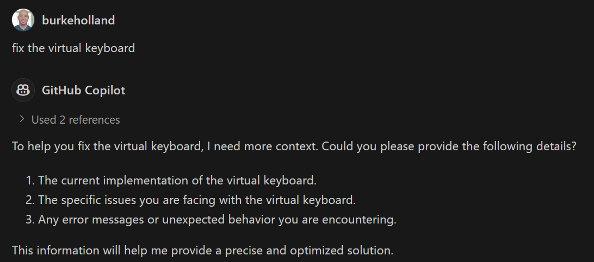

Prompt engineering - or should I say ["Prompt Negotiation"](./2024-04-21-prompt-engineering.md) - is (currently) an important part of working with GitHub Copilot. Your success in working with the various available models will be directly related to how well you prompt them. While GitHub Copilot tries to handle much of the prompt engineering for you behind the scenes, there is still a lot you can do yourself to improve the accuracy of answers with the use of Custom Instructions.

## Custom Instructions

[Custom Instructions](https://code.visualstudio.com/docs/copilot/copilot-customization) are exactly that - custom prompts that get sent to the model with every request. 

You can define these at a project level or at an editor level. Often these are demonstrated as specific project level instructions such as a command like `prefer fetch over axios`. 

These very specific types of instructions are helpful, but not nearly as helpful as global prompt engineering "hacks" that you can add to your VS Code user settings to apply to all chat interactions.

These more generic prompt engineering "best practices" will help you avoid pitfalls and get better code from the LLM.

You can add the "global instructions" that I'm about to give you by going to your User Settings (JSON) file and adding keys like so...

```json
"github.copilot.chat.codeGeneration.instructions": [
    // custom instructions will go here
    { "text": "this is an example of a custom instruction" }
]
```

Ok - let's do it.

## Ask for missing context

>"Avoid making assumptions. If you need additional context to accurately answer the user, ask the user for the missing information. Be specific about which context you need."

The achilles heal of LLM's is that they are designed to provide a response no matter what. It's [the paperclip problem](https://cepr.org/voxeu/columns/ai-and-paperclip-problem) applied to LLM's. If you design a system to provide an answer, it is going to do that at all costs. This is why we get hallucinations. 

If I said to you, "make a GET request to the api", you would likely ask me several follow-up questions so that you could actually complete that task in a way that works. An LLM will just write a random GET request because it _does not actually care_ if the code works or not.

Copilot tries to mitigate a lot of this for you with its sytem prompt, but you can reduce hallucinations further by instructing the AI to ask you for clarification if it needs more context.

This isn't bullet proof. LLM's seem so hell bent on answering you at all costs that often I find this instruction is just ignored. But on the occasions that it works, it's a nice surprise.



## Provide file names

>"Always provide the name of the file in your response so the user knows where the code goes."

I've noticed that Copilot will sometimes give me back several blocks of code, but won't mention where they belong. I then have to figure out which files it is referring to which takes an extra cycle. This prompt forces the LLM to always provide the file name. 

If you are working in theoretical space where you aren't talking about specific project files, Copilot will provide made up file names for the code snippets. This is fine because it's a detail that doesn't matter in that context.

## Avoid public code

>"Avoid generating code verbatim from public code examples. Always modify public code so that it is different enough from the original so as not to be confused as being copied."

If your Copilot is provided by your company like mine is, it is likely subject to restrctictions such as the dreaded "The response matched public code" error message. This is unfortunate because a lot of times I want to see how a thing has been done by others. That error message from Copilot sends me to Stack Overflow or GitHub and generally just irratates me to no end.

This prompt doesn't eliminate the public code filtering entirely, but my soft measuring shows that it reduces it by about 50%. I have no data to back that up - it's only a gut feel. Anecdotes and all that.

## Code quality incentives

> "All code you write MUST be fully optimized. 'Fully optimized' includes maximizing algorithmic big-O efficiency for memory and runtime, following proper style conventions for the code, language (e.g. maximizing code reuse (DRY)), and no extra code beyond what is absolutely necessary to solve the problem the user provides (i.e. no technical debt). If the code is not fully optimized, you will be fined $100."

This prompt comes almost verbatim from Max Wolf's ["Can LLM's write better code"](https://minimaxir.com/2025/01/write-better-code/). In this post, Max decribes trying to get LLM's to write better by code iterating on the same piece of code with the prompt, "write better code". He finds that the above prompt combined with Chain of Thought produces very nice results - specifically when used with Claude. He uses the very last line to incentivize the LLM to improve it's answers in iteration. In other words, if the LLM returns a bad answer, your next response should inform the LLM that it has been fined. In theory, this makes the LLM write better code because it has an incentive to do so when it otherwise might keep on returning bogus answers.

Note that chain of thought is already present in the system prompt for Copilot.

## The model matters more than the prompt

While these prompts will help you get better results from Copilot, in my experience the most effective thing you can do is pick the right model for the job. As of today, I see it like this...

**GPT-4o**: Specific tasks that don't require much "creativity". Use 4o when you know exactly what code you need and it's just faster if the LLM writes it.

**Claude**: Harder problems and solutions requiring creative thinking. This would be when you aren't sure how something should be implemented, it requires multiple changes in multiple files, etc. Claude is also exponentially better at helping with design tasks than GPT-4o seems to be in my experience

**o1**: Implementation plans, brainstorming and docs writing. You can think of o1 as your pair PM more than your pair programmer.

**Gemini**: I've not found this model particularly useful yet. 

## Living instructions

I hope these instructions are helpful for you. I consider them "living" and I hope to keep this list updated as I add more or change these as Copilot itself evolves, new models come along and our general knowledge of prompting improves.

